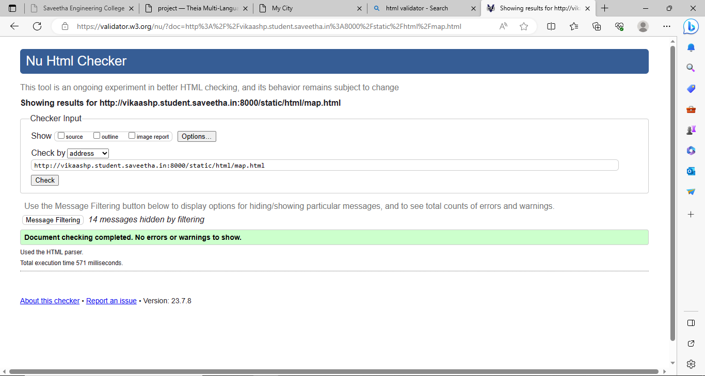

# Ex04 Places Around Me
## AIM
To develop a website to display details about the places around my house.

## DESIGN STEPS

### STEP 1
Create a Django admin interface.

### STEP 2
Download your city map from Google.

### STEP 3
Using ```<map>``` tag name the map.

### STEP 4
Create clickable regions in the image using ```<area>``` tag.

### STEP 5
Write HTML programs for all the regions identified.

### STEP 6
Execute the programs and publish them.

## CODE
```
map.html
<!DOCTYPE html>
<html lang="en">
<head>
<title>My City</title>
</head>
<body>
<h1 align="center">
<font color="red"><b>Madurai</b></font>
</h1>
<h3 align="center">
<font color="blue"><b>Vikaash P (23000463)</b></font>
</h3>
<center>

<map name="MyCity">
<area shape="circle" coords="190,50,20" href="/static/html/dominos.html" title="Domino's">
<area shape="rectangle" coords="230,30,260,60" href="/static/html/pe.html" title="Peter England">
<area shape="circle" coords="400,350,50" href="/static/html/aristo.html" title="Aristo Hospital">
<area shape="circle" coords="400,200,75" href="/static/html/pr.html" title="Prisma Store">
<area shape="rectangle" coords="490,150,870,320" href="/static/html/gt.html" title="Green Trends">
</map>
</center>
</body>
</html>

dominos.html
<!DOCTYPE html>
<html lang="en">
<head>
<title>Domino's</title>
</head>
<body bgcolor="cyan">
<h1 align="center">
<font color="red"><b>Madurai</b></font>
</h1>
<h3 align="center">
<font color="blue"><b>Domino's</b></font>
</h3>
<hr size="3" color="red">
<p align="justify">
<font face="Courier New" size="5">
<b>
 Domino's is an American multinational pizza restaurant chain. Founded in 1960, the chain is
  owned by master franchisor Domino's Pizza, Inc and led by CEO Russell Weiner.It sells quality and 
  tasty pizzas and the delivery service is too good .
</b>
</font>
</p>
</body>
</html>

pe.html
<!DOCTYPE html>
<html lang="en">
<head>
<title>Peter England</title>
</head>
<body bgcolor="pink">
<h1 align="center">
<font color="red"><b>Madurai </b></font>
</h1>
<h3 align="center">
<font color="blue"><b>Peter England</b></font>
</h3>
<hr size="3" color="red">
<p align="justify">
<font face="Arial" size="5">
<b>It is a very good choice for buying formal clothes and party wear for men . They have 
   very exciting offers which attracts the customers very much</b>
</font>
</p>
</body>
</html>

aristo.html
<!DOCTYPE html>
<html lang="en">
<head>
<title>Aristo Hospital</title>
</head>
<body bgcolor="yellow">
<h1 align="center">
<font color="red"><b>Madurai</b></font>
</h1>
<h3 align="center">
<font color="blue"><b>Aristo Hospital
</b></font>
</h3>
<hr size="3" color="red">
<p align="justify">
<font face="Tahoma" size="5">
Aristo is a Multispeciality Hospital situated in Madurai . It is a very good hospital and 
uses very high standard equipments to provide quality care for the patients . </font>
</p>
</body>
</html>

gt.html
<!DOCTYPE html>
<html lang="en">
<head>
<title>Green Trends</title>
</head>
<body bgcolor="orange">
<h1 align="center">
<font color="red"><b>Madurai</b></font>
</h1>
<h3 align="center">
<font color="blue"><b>Green Trends</b></font>
</h3>
<hr size="3" color="red">
<p align="justify">
<font face="Georgia" size="5">
Green Trends is a unisex saloon which provides a variety of hairstyle options to 
choose from.They even provide hairfall and dandruff repair treatment…</font>
</p>
</body>
</html>

pr.html

<!DOCTYPE html>
<html lang="en">
<head>
<title>Prisma Store</title>
</head>
<body bgcolor="lime">
<h1 align="center">
<font color="red"><b>Madurai</b></font>
</h1>
<h3 align="center">
<font color="blue"><b>Prisma Store</b></font>
</h3>
<hr size="3" color="red">
<p align="justify">
<font face="Georgia" size="5">
Prisma Store which is a women's clothing store located in Madurai provides a 
variety of clothing options for women along with many exciting offers</font>
</p>
</body>
</html>

```


## OUTPUT


## HTML VALIDATOR



## RESULT
The program for implementing image maps using HTML is executed successfully.
